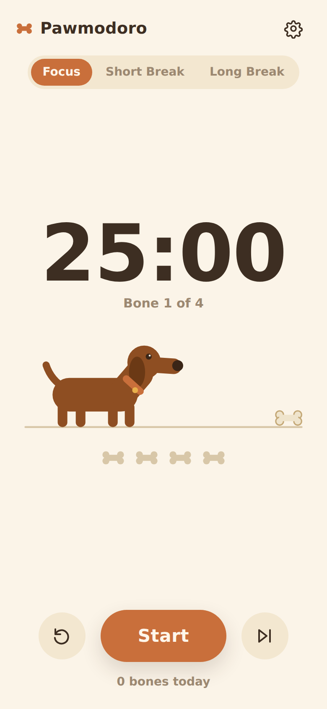
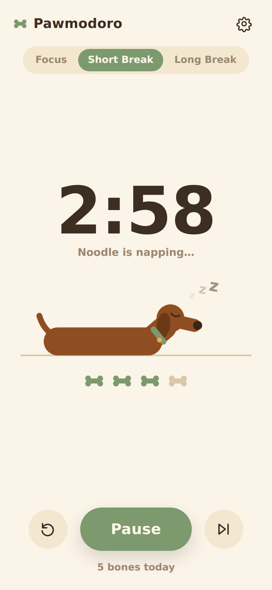

# 🦴 Pawmodoro — the Dachshund Pomodoro

A cozy pomodoro timer starring **Noodle the dachshund**. While you focus, Noodle
slowly s-t-r-e-t-c-h-e-s toward a bone at the end of the yard — when the session
ends, woof!, bone earned, and Noodle naps through your break (and un-stretches
while resting, obviously).

It's a **Progressive Web App**: no app store, no build step, no dependencies.
You open it in your phone's browser once, tap *Add to Home Screen*, and it
behaves like a native app — full screen, its own icon, works offline.

| Focus | Break |
| :---: | :---: |
|  |  |

## Features

- 🐶 Noodle stretches with your progress and naps on breaks (Zzz included)
- 🦴 Earn a bone per finished focus session — 4 bones triggers a long break
- ⏱️ Timestamp-based timer: stays accurate when your phone locks or the app sleeps
- 🔁 Auto-start breaks/focus, configurable durations, long-break cadence
- 🔊 Synthesized *woof* + chime (no audio files), vibration on phones
- 🔔 Optional notifications when a session ends in the background
- 📴 Works offline after first load (service worker cache)
- 🌙 Automatic dark mode, respects reduced-motion
- 📺 Optional "keep screen awake" while the timer runs
- 🐾 Tap Noodle for a woof

## From VS Code to your phone

The only requirement is that the phone reaches the page over **HTTPS** (that's
what unlocks "install" + offline). Three easy ways:

### Option A — VS Code port forwarding (fastest)

1. Open this folder in VS Code.
2. Serve the app locally, e.g. with the **Live Server** extension (click
   "Go Live"), or from a terminal:
   ```bash
   cd pawmodoro
   python3 -m http.server 5500        # or: npx serve .
   ```
3. In VS Code open the **Ports** panel (`Terminal → Ports` or the antenna icon),
   click **Forward a Port**, enter `5500`.
4. Right-click the forwarded port → **Port Visibility → Public**, then copy the
   `https://…devtunnels.ms` URL.
5. Open that URL on your phone (you'll sign in to the tunnel once) →
   - **iPhone (Safari):** Share button → **Add to Home Screen**
   - **Android (Chrome):** ⋮ menu → **Add to Home screen / Install app**

### Option B — GitHub Pages (permanent install)

1. Push this repo to GitHub.
2. Repo **Settings → Pages** → deploy from your branch, folder `/ (root)`.
3. Visit `https://<you>.github.io/<repo>/pawmodoro/` on your phone and add it to
   your home screen. Done — the app now lives at a stable URL and updates when
   you push.

### Option C — same-Wi-Fi quick test (no HTTPS)

Serve as in Option A, find your computer's LAN IP (`ip addr` / `ipconfig`), and
open `http://<that-ip>:5500` on your phone. Great for quick testing — but
offline mode and install prompts need HTTPS, so use A or B for the real thing.

## Development

Everything is hand-rolled vanilla HTML/CSS/JS:

```
pawmodoro/
├── index.html          # markup + the inline SVG dachshund
├── style.css           # theme, layout, dog animations (wag/trot/blink/Zzz)
├── app.js              # timer state machine, audio, notifications, wake lock
├── sw.js               # offline cache
├── manifest.webmanifest
├── icons/              # generated app icons
└── tools/make_icons.py # regenerates icons (pure Python, no deps)
```

The timer stores an absolute end timestamp (not a countdown), so backgrounding,
locking the phone, or killing the tab never loses time — on return it
fast-forwards through any phases that finished while it was away.

Regenerate icons after editing the art:

```bash
python3 tools/make_icons.py
```
